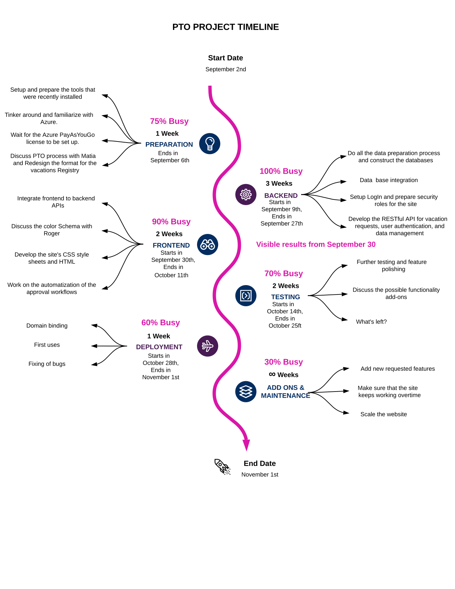
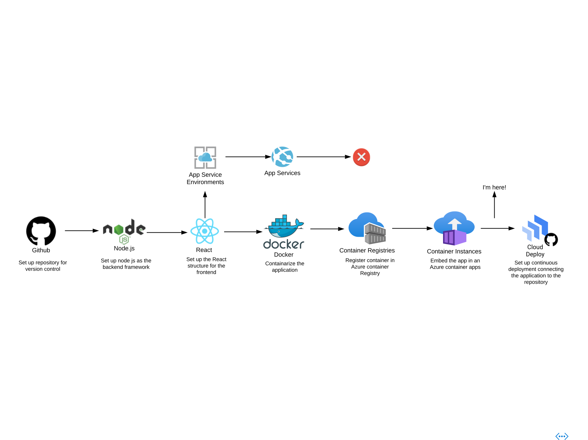

# PTO-Site

### Purpose
The purpose of this project is to create a website that facilitates the process for requesting the different kinds of time off.
This is intented for the internal use in Quantum.
The person working on this project right now is Sebastián Mendoza, also from Quantum.

### Timeline
This project is going to be finished approximately on November 2nd.
See below for the estimated timeline.

### Progress
Right now, the project is in it's early stages.
See below for the progress that has been achieved so far.

